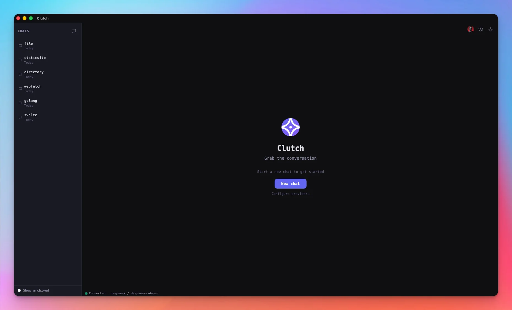
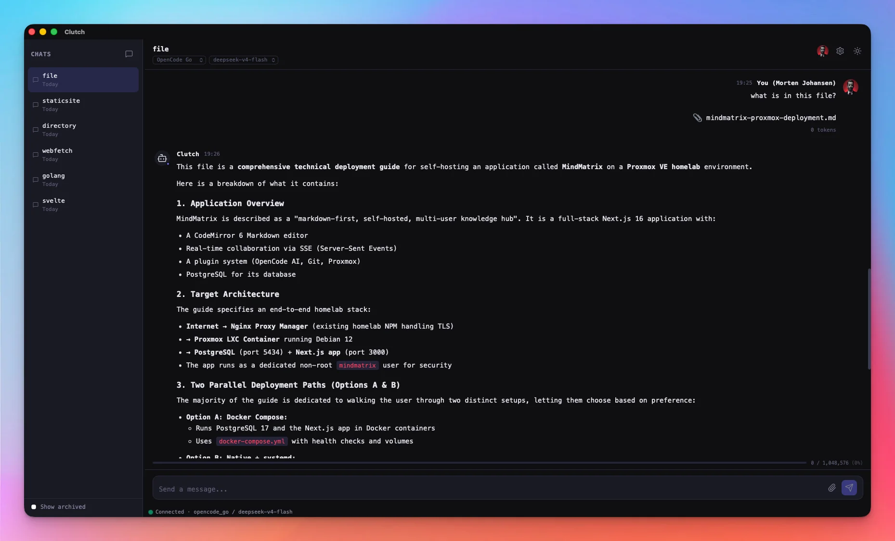
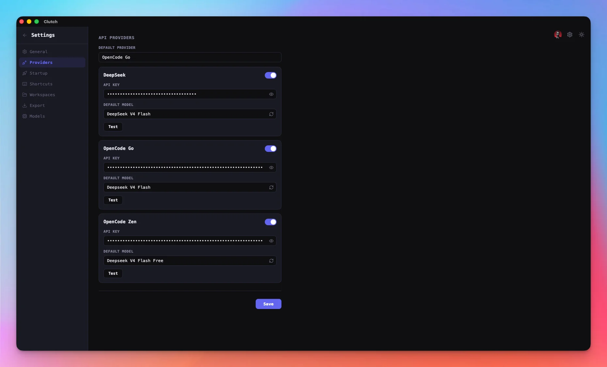

# Clutch

**Grab the conversation**

Cross-platform desktop AI chat application featuring multi-provider support, markdown rendering with syntax highlighting, file attachments, web fetching, and local file system reading. Built with Tauri v2, SvelteKit, and SQLite.

---

## Features

- **Multi-provider chat** — [DeepSeek](https://deepseek.com), [OpenCode Go](https://opencode.ai/docs/go/), and [OpenCode Zen](https://opencode.ai/docs/zen/) with streaming responses
- **Rich markdown** — Tables, code blocks with syntax highlighting (highlight.js), blockquotes, lists
- **File handling** — Drag-and-drop attachments, local file system reading, web URL fetching (HTML→Markdown conversion)
- **Context awareness** — Injected file/web content reaches the LLM as hidden context
- **User profile** — Avatar (icon or uploaded image), display name, custom color
- **Theming** — Clutch, Nord, Dracula, Cyberpunk, Catppuccin, GitHub, Tokyo Night, and Monokai themes with light/dark modes
- **Internationalization** — English, Danish, German, Polish, French (typesafe-i18n)
- **Conversation management** — Pin, archive, delete, bulk actions
- **Export** — Markdown, JSON, HTML, or Plain Text with metadata options
- **System tray** — Minimize to tray, close to tray, start minimized, global shortcut (CmdOrCtrl+Ctrl+K / CmdOrCtrl+Alt+K) to toggle window
- **Persistence** — SQLite backend with WAL, connection pooling, auto-save settings
- **Skills system** — 25 curated skills from Anthropic and Superpowers (code review, debugging, docs, diagrams, TDD, brainstorming)
- **Slash commands** — Type `/` for a command palette with 12 commands (theme, model, provider, read, fetch, skill, and more). Four commands (`/theme`, `/model`, `/provider`, and `/skill`) load scrollable option menus dynamically.
- **File reference middleware** — Type a file path directly in chat (`~/Documents/report.md`) and Clutch auto-detects and injects its contents into context
- **Context window management** — Per-model token limits with auto-trim at 90%
- **Resizable sidebar** — Drag handle, width persisted across launches
- **Theme toggle** — Sun/Moon button in topbar, instantly switches light/dark
- **Startup behavior** — Launch on boot, start minimized, close to tray

---

## Tech Stack

| Layer    | Technology                                                                        |
| -------- | --------------------------------------------------------------------------------- |
| Desktop  | [Tauri v2](https://v2.tauri.app/) (Rust)                                          |
| Frontend | [SvelteKit](https://svelte.dev/docs/kit) + [Svelte 5](https://svelte.dev/)        |
| Database | [SQLite](https://www.sqlite.org/) via [SQLx](https://github.com/launchbadge/sqlx) |
| Styling  | CSS custom properties, [JetBrains Mono](https://www.jetbrains.com/lp/mono/)       |
| Icons    | [Lucide](https://lucide.dev/)                                                     |
| Bundler  | [Vite](https://vitejs.dev/)                                                       |
| Package  | [pnpm](https://pnpm.io/)                                                          |

---

## Production Dependencies

### Rust — Backend Crates

| Crate                                                                                                                                                                           | Role                              |
| ------------------------------------------------------------------------------------------------------------------------------------------------------------------------------- | --------------------------------- |
| [tauri](https://crates.io/crates/tauri) + plugins                                                                                                                               | Desktop framework                 |
| [reqwest](https://crates.io/crates/reqwest)                                                                                                                                     | HTTP client (API streaming)       |
| [sqlx](https://crates.io/crates/sqlx)                                                                                                                                           | Async SQLite with connection pool |
| [tokio](https://crates.io/crates/tokio)                                                                                                                                         | Async runtime                     |
| [serde](https://crates.io/crates/serde) / [serde_json](https://crates.io/crates/serde_json)                                                                                     | Serialization                     |
| [chrono](https://crates.io/crates/chrono)                                                                                                                                       | Date/time handling                |
| [url](https://crates.io/crates/url)                                                                                                                                             | URL parsing and IP validation     |
| [scraper](https://crates.io/crates/scraper)                                                                                                                                     | HTML parsing (OG tags, title)     |
| [html2md](https://crates.io/crates/html2md)                                                                                                                                     | HTML → Markdown conversion        |
| [sha2](https://crates.io/crates/sha2)                                                                                                                                           | Cache key hashing                 |
| [tracing](https://crates.io/crates/tracing) + [tracing-subscriber](https://crates.io/crates/tracing-subscriber) + [tracing-appender](https://crates.io/crates/tracing-appender) | Structured logging                |
| [tiktoken-rs](https://crates.io/crates/tiktoken-rs)                                                                                                                             | Token counting                    |
| [futures-util](https://crates.io/crates/futures-util)                                                                                                                           | Stream processing                 |

### Frontend — NPM Packages

| Package                                                                    | Role                     |
| -------------------------------------------------------------------------- | ------------------------ |
| [@tauri-apps/api](https://www.npmjs.com/package/@tauri-apps/api) + plugins | Tauri IPC bridge         |
| [@lucide/svelte](https://www.npmjs.com/package/@lucide/svelte)             | UI icons                 |
| [marked](https://www.npmjs.com/package/marked)                             | Markdown rendering       |
| [highlight.js](https://www.npmjs.com/package/highlight.js)                 | Code syntax highlighting |
| [DOMPurify](https://www.npmjs.com/package/dompurify)                       | HTML sanitization        |
| [typesafe-i18n](https://www.npmjs.com/package/typesafe-i18n)               | Internationalization     |
| [uuid](https://www.npmjs.com/package/uuid)                                 | Message/session IDs      |

### Development — NPM Packages

| Package                                                                                                                             | Role                   |
| ----------------------------------------------------------------------------------------------------------------------------------- | ---------------------- |
| [SvelteKit](https://www.npmjs.com/package/@sveltejs/kit)                                                                            | App framework          |
| [adapter-static](https://www.npmjs.com/package/@sveltejs/adapter-static)                                                            | Static site generation |
| [vite](https://www.npmjs.com/package/vite)                                                                                          | Build tool             |
| [svelte-check](https://www.npmjs.com/package/svelte-check) + [typescript](https://www.npmjs.com/package/typescript)                 | Type checking          |
| [vitest](https://www.npmjs.com/package/vitest) + [@testing-library/svelte](https://www.npmjs.com/package/@testing-library/svelte)   | Unit + component tests |
| [playwright](https://www.npmjs.com/package/playwright)                                                                              | E2E testing            |
| [prettier](https://www.npmjs.com/package/prettier) + [prettier-plugin-svelte](https://www.npmjs.com/package/prettier-plugin-svelte) | Code formatting        |
| [@tauri-apps/cli](https://www.npmjs.com/package/@tauri-apps/cli)                                                                    | Build + packaging      |

---

## Installation

### Prerequisites

- **Rust** 1.77+ with `wasm32-unknown-unknown` target
- **Node.js** 22+ with **pnpm** (`npm install -g pnpm`)
- **macOS**: Xcode Command Line Tools
- **Linux**: `libwebkit2gtk-4.1-dev`, `libgtk-3-dev`, `libsqlite3-dev`
- **Windows**: WebView2 runtime (bundled with Windows 11, installable on Windows 10)

### Build from source

```bash
git clone https://github.com/mojoaar/clutch.git
cd clutch
pnpm install
./scripts/build.sh
```

### Download

Prebuilt binaries available on [GitHub Releases](https://github.com/mojoaar/clutch/releases).

---

## Screenshots

<table>
<tr>
  <td align="center"><br/><sub>Welcome screen</sub></td>
  <td align="center"><br/><sub>Streaming chat</sub></td>
  <td align="center"><br/><sub>Provider settings</sub></td>
</tr>
</table>

## Changelog

See [CHANGELOG.md](CHANGELOG.md) for the full release history.

---

## License

**AGPL-3.0**. See [LICENSE](LICENSE) for details.

Copyright © 2026 [Morten Johansen](https://johansen.foo)

Clutch is built with gratitude to the maintainers of `tauri`, `sqlx`, `reqwest`, `marked`, `highlight.js`, `typesafe-i18n`, `DOMPurify`, `@lucide/svelte`, and the entire SvelteKit ecosystem.
